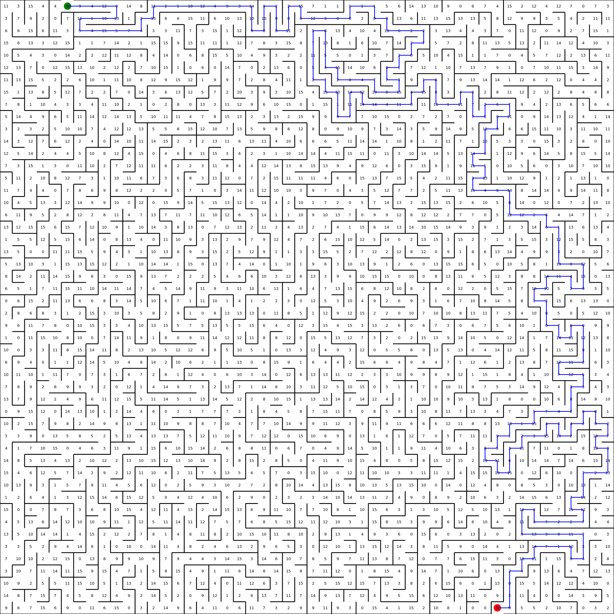

## Maze Generator & Solver (Java)

This Java application generates and solves mazes, outputting an SVG file with the graphical representation. You can either generate a random maze (optionally seeded) or solve an existing binary maze file.

---

## Features

- **Maze generation**: Fully randomized mazes, reproducible with seed
- **Maze solving**: Reads a maze in binary format and outputs an SVG solution
- **SVG output**: Clean visual representation of the maze
- **Docker-compatible**: No Java or Maven required on host machine


### Data Structures Used

- **Graphs**:
  - The maze is internally modeled as a **bidirectional, weighted graph**, where each cell is a vertex and edges connect adjacent, open cells.
- **Priority Queue (MinHeap)**:
  - Used in Dijkstra’s algorithm to efficiently select the next closest cell.
- **Hash maps and sets**:
  - Used to track visited nodes, predecessors, and distances during pathfinding.
- **2D arrays**:
  - Represent the maze grid for generation and logical traversal.

---

### Algorithm: Dijkstra’s Shortest Path

To solve the maze, the program applies **Dijkstra’s algorithm**:

> “Given a graph with non-negative edge weights, Dijkstra's algorithm finds the shortest path from a starting vertex to all other vertices.”

---

## Input Modes

### 1. **Generate Maze (binary output)**

```bash
java -jar proyecto3.jar -g -w <width> -h <height> [-s <seed>] > maze.maze
 maze-generator-solver
```
-g: Generate a maze

-w N: Maze width

-h N: Maze height 

-s N: Optional seed for reproducibility

```bash
java -jar proyecto3.jar -g -w 50 -h 40 -s 42 > bin-maze.maze
```
### 2. Solve Maze (SVG output)

```bash
java -jar proyecto3.jar < maze.maze > solved.svg
```

This mode is triggered automatically when no flags are passed. The app reads the binary maze from standard input and prints the solved maze as an SVG.

## Docker Usage
### Build Image:

```bash
docker build -t java-maze .
```
Generate a Maze

```bash
docker run --rm java-maze -g -w 50 -h 40 > maze.maze
```

### Solve a Maze

```bash
cat maze.maze | docker run --rm -i java-maze > solved.svg
```

or

```bash
docker run --rm -i java-maze < bin-maze.maze > solved.svg
```
# Examples:
```bash
java -jar proyecto3.jar -g -w 50 -h 40 -s 123 > bin-maze.maze
```

